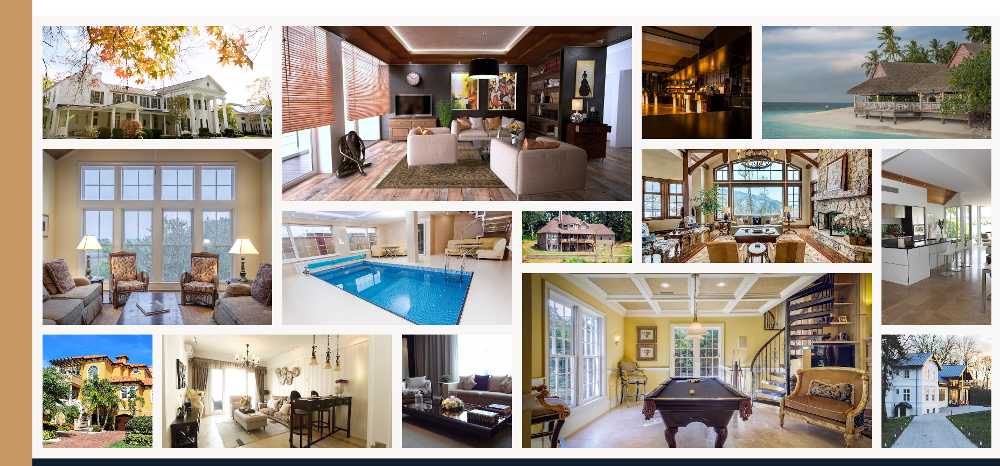
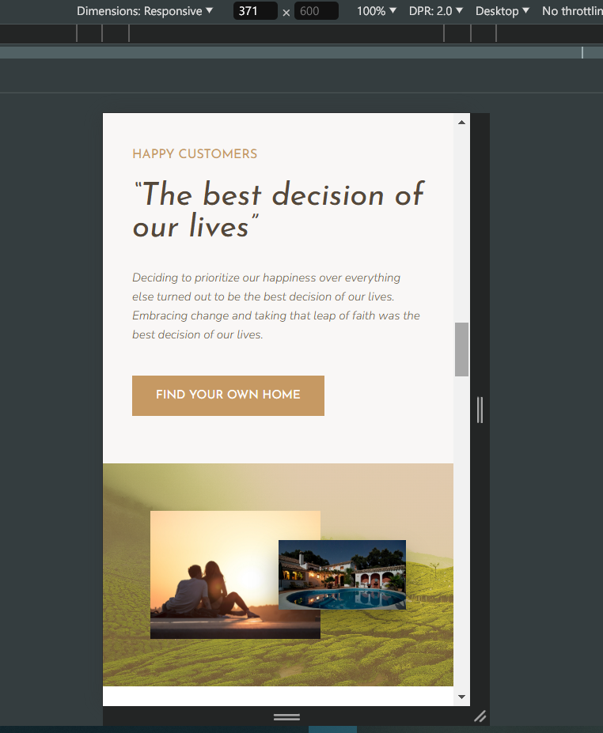

  

## 𝗧𝗵𝗶𝘀 𝗽𝗿𝝾ᒍ𝗲𝗰𝘁 𝗶𝘀 𝗯𝗮𝘀𝗲𝗱 𝝾𝗻 ᒍ𝝾𝗻𝗮𝘀 𝗦𝗰𝗵𝗺𝗲𝗱𝘁𝗺𝗮𝗻𝗻'𝘀 [𝝖𝗗𝗩𝝖𝝢𝗖𝗘𝗗 𝗛𝗧𝗠𝗟-𝗖𝗦𝗦 & 𝗦𝝖𝗦𝗦(𝗦𝗖𝗦𝗦)](https://www.udemy.com/user/jonasschmedtmann/) 𝗰𝝾𝞄𝗿𝘀𝗲. 𝝪𝝾𝞄 𝘀𝗵𝝾𝞄𝗹𝗱 𝗰𝗵𝗲𝗰𝗸 𝗵𝗶𝘀 𝗰𝝾𝞄𝗿𝘀𝗲. 𝝖𝗹𝗹 𝘁𝗵𝗲 𝗰𝗿𝗲𝗱𝗶𝘁𝘀 𝗴𝝾 𝘁𝝾 𝗺𝝲 𝗯𝗲𝗮𝞄𝘁𝗶𝗳𝞄𝗹 𝘁𝗲𝗮𝗰𝗵𝗲𝗿 ᒍ𝝾𝗻𝗮𝘀 𝗦𝗰𝗵𝗺𝗲𝗱𝘁𝗺𝗮𝗻𝗻--

## 𝝢𝗲𝘅𝘁𝗲𝗿-𝗿𝗲𝘀𝗽𝝾𝗻𝘀𝗶𝝼𝗲-𝗽𝗿𝝾ᒍ𝗲𝗰𝘁---𝗖𝗦𝗦-𝗚𝗥𝗜𝗗

✅[𝗩𝗶𝗲𝞈 𝗱𝗲𝗺𝝾](https://ph0enix46.github.io/Nexter-responsive-project---CSS-GRID/) 
<br/>
🐛[𝗕𝞄𝗴 𝗿𝗲𝗽𝝾𝗿𝘁](https://github.com/pH0enix46/Nexter-responsive-project---CSS-GRID/issues)

## 𝝖𝗯𝝾𝞄𝘁
𝝢𝝾𝘁𝗵𝗶𝗻𝗴 ᒍ𝞄𝘀𝘁 𝗺𝗲 𝗮𝗻𝗱 𝗺𝝲 𝘁𝗲𝗮𝗰𝗵𝗲𝗿 ᒍ𝝾𝗻𝗮𝘀 𝗦𝗰𝗵𝗺𝗲𝗱𝘁𝗺𝗮𝗻𝗻 𝗵𝗮𝝼𝗲 𝗳𝞄𝗻 𝞈𝗶𝘁𝗵 𝗖𝗦𝗦 𝗚𝗥𝗜𝗗😄

𝝖𝗻𝝲𝞈𝗮𝝲𝘀 𝘁𝗵𝗶𝘀 𝗽𝗿𝝾ᒍ𝗲𝗰𝘁 𝗶𝘀 𝗯𝗮𝘀𝗲𝗱 𝝾𝗻 𝗮𝗱𝝼𝗮𝗻𝗰𝗲𝗱 𝗖𝗦𝗦 𝗚𝗥𝗜𝗗💪

## 𝗦𝗰𝗿𝗲𝗲𝗻𝘀𝗵𝝾𝘁𝘀







✅𝗘𝗻ᒍ𝝾𝝲! 𝗳𝝾𝗿 𝗹𝗲𝗮𝗿𝗻𝗶𝗻𝗴
<br/>
❌𝗕𝞄𝘁 𝗱𝝾𝗻'𝘁 𝗰𝝾𝗽𝝲 𝗺𝗶𝗻𝗲

## 𝝖𝗰𝗸𝗻𝝾𝞈𝗹𝗲𝗱𝗴𝗺𝗲𝗻𝘁𝘀
𝗠𝝲 𝗹𝝾𝝼𝗲𝗹𝝲 𝘁𝗲𝗮𝗰𝗵𝗲𝗿 [ᒍ𝝾𝗻𝗮𝘀 𝗦𝗰𝗵𝗺𝗲𝗱𝘁𝗺𝗮𝗻𝗻](https://github.com/jonasschmedtmann)

```
𝗛𝗮𝝼𝗲 𝗮 𝗻𝗶𝗰𝗲 𝗗𝗮𝝲!😸
```
