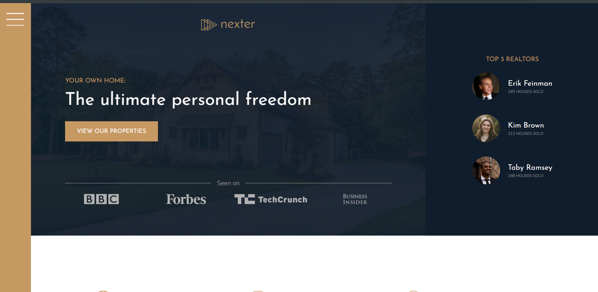

  

# Project Title

This project is based on Jonas Schmedtmann's [ADVANCED HTML-CSS & SASS(SCSS)](https://www.udemy.com/user/jonasschmedtmann/) course. You should check his course. All the credits go to my beautiful teacher Jonas Schmedtmann--

## Nexter-responsive-project---CSS-GRID

✅[View demo](https://ph0enix46.github.io/Nexter-responsive-project---CSS-GRID/) 🐛[Bug report](https://github.com/pH0enix46/Nexter-responsive-project---CSS-GRID/issues)


## About Nexter
Nothing just me and my teacher [Jonas Schmedtmann](https://github.com/jonasschmedtmann) have fun with CSS GRID😄

Anyways this project is based on advanced CSS GRID💪

### Screenshots



## Installation

Clone the repo
```
 https://github.com/pH0enix46/Nexter-responsive-project---CSS-GRID.git
```
✅Enjoy! for learning 

❌But don't copy mine
## Acknowledgments
My lovely teacher [Jonas Schmedtmann](https://github.com/jonasschmedtmann)


```
Have a nice Day!😸
```
